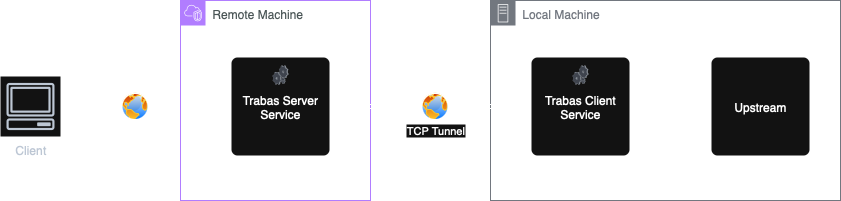
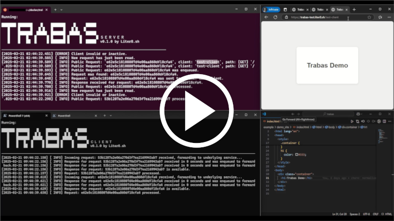

# Trabas: HTTP Tunneling Tool (ngrok Alternative)
```
     ███████ ███████    █    ███████    █     █████ 
        █    █     █   █ █   █     █   █ █   █      
        █    ███████  █████  ███████  █████   █████ 
        █    █   █   █     █ █     █ █     █       █
        █    █   ██  █     █ ███████ █     █  █████  
```

Trabas is an open-source, lightweight HTTP tunneling tool (an **ngrok alternative**) that lets you securely expose a local web service to the public internet over a persistent TCP tunnel. It focuses on simplicity, reproducibility, and observability through an __all-in-one__ CLI. Ideal for quick API demos, webhook development, prototyping, or remote access.


## Key Features
- Fast, minimal HTTP tunneling over stable TCP.
- Single portable binary.
- One server can multiplex multiple clients.
- Optional Redis-backed request queue for scale.
- Built-in rate limiting & response caching.
- TLS support (configurable).
- Simple configuration and clear CLI feedback.

## Architecture & Usage Overview
Trabas runs as two coordinated processes:

1. Server Service
  - Accepts inbound public HTTP requests and maintains tunnels to connected clients.
  - Forwards each public request to the matching client tunnel.
  - Can optionally leverage Redis for distributed queueing (multiple server instances / HA).

2. Client Service
  - Maintains an outbound TCP tunnel to the server.
  - Proxies incoming tunnel traffic to your local underlying service (e.g. localhost:8080).

This decoupling enables multiple local services to be exposed through a single public endpoint cluster.

## Diagram
Here's an example of how users access our local service through the internet:



## Demo (Video)
Watch a short demo of HTTP tunneling with Trabas:

[](https://jotling.liter8.sh/trabas-demo-v1?media=video "Trabas HTTP Tunneling Demo")

## Why Trabas vs ngrok?
- Open-source (no vendor lock-in).
- Self-hostable for internal tooling.
- Simple, transparent protocol.
- Lightweight with zero dependencies (except optional Redis).

## Next Steps
- Get started: see [Installation](./user_guide/installation.md)
- Configure tunnels: see [Tunnel Setup](./user_guide/tunnel_setup)
- Explore CLI: see [CLI Reference](./reference_guide/cli)

---
Need a feature? Open an issue or suggest an edit using the Edit button in the top bar.